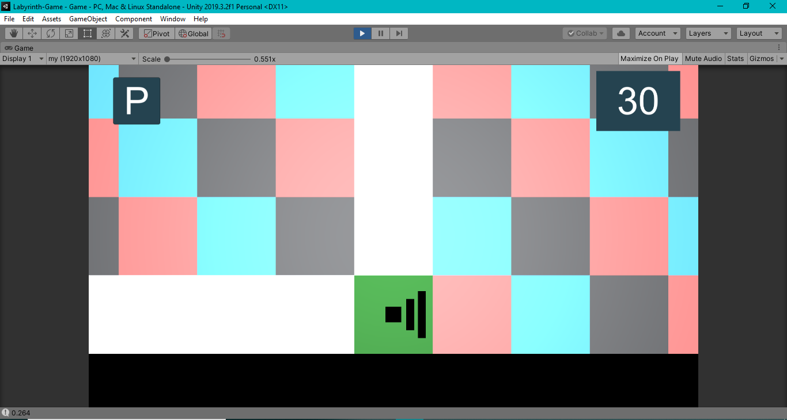

# Labyrinth-Game

This game is my personal opinion that I developed on Unity. I used the [labyrinth algorithm](https://github.com/mwlt68/Labyrinth-algorithm) that I had developed before in this project.

# Project Content
- The first player to reach the exit point in the game wins.
- It can be played with touch on Android.
- It can be played on the desktop and on the web with the ton keys.
- If the same direction button is pressed repeatedly, it moves forward automatically.
- It is played against the bot.
- Multiplayer part has not been developed.
- In case of winning the game, there is a leveling mechanism by accumulating experience.
- Settings are available. (Volume adjustment - Sensitivity adjustment - Reverse key direction)

# [Click](https://vimeo.com/568469905) for the preview video of the project

# Project View

## Game Screen

## Menu Screen

## Options Screen

## Game Pause Screen

